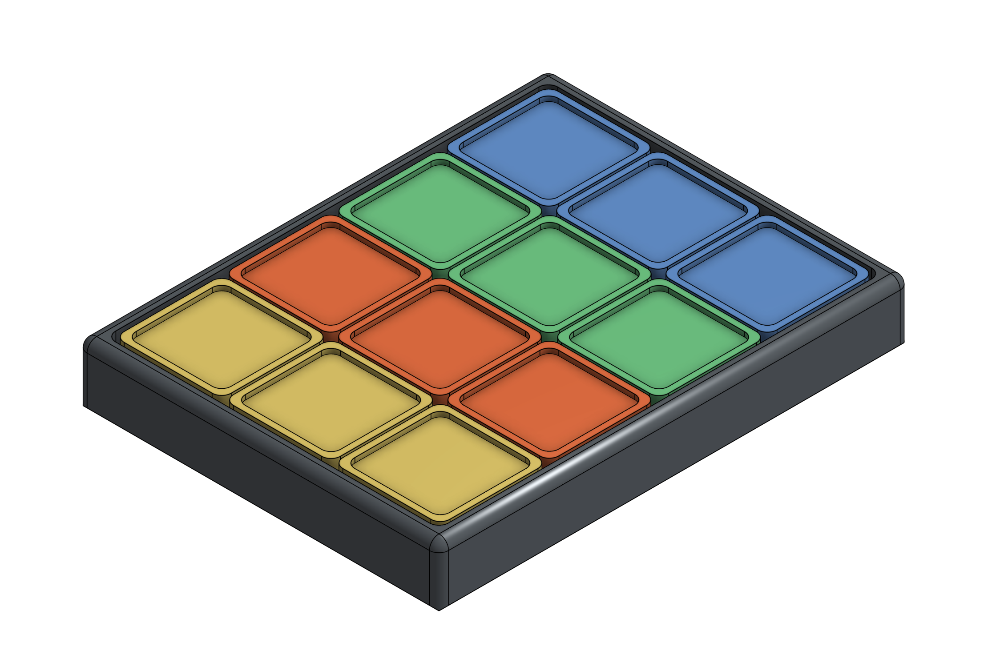
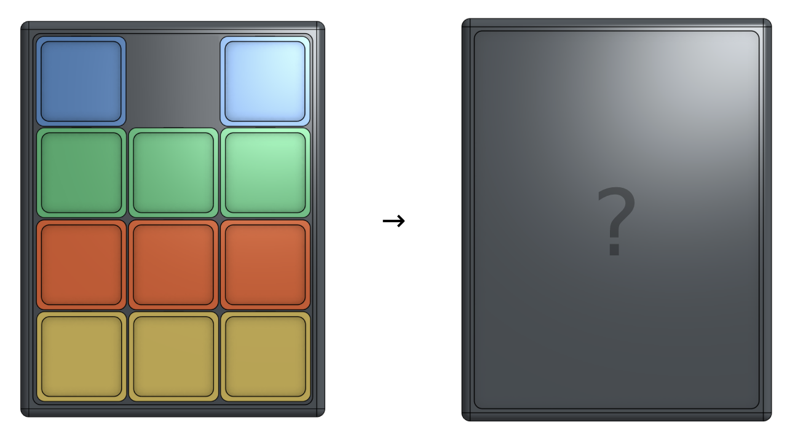

= Haleakaslīde
Feel the rhythm!; Feel the slide!

[.board]

[quote,R. C. Howell, March 2023]
____
The Haleakaslīde is a double-sided sliding piece puzzle. Each game is played by sliding the tiles from the starting position to the desired position. xref:https://media.giphy.com/media/l1J9u3TZfpmeDLkD6/giphy.gif[No lifting!] 
____

== Game I — The Color Game

Starting with all tiles organized by color (left image), you must arrange the tiles such that no two same-colored tiles are touching. 

[admonition,caption="challenge"]
NOTE: Try doing it in 20 moves.

== Game II — Dot Game

Remove a blank tile. Arrange them such that the dot is in the center of the circle.

[.text-center]
image::img/ZOT.png[ZOT]

[admonition,caption="challenge"]
NOTE: Try doing it in 17 moves.

== Construction

You can create your own Haleakaslīde by 3D printing the base, base plate, and 12 chips. It is constructed by placing round magnets (2mm thick, 5mm diameter) in each piece as well as each hole in the base. Once each magent is placed in the board, attach the base plate.

.STL Files
[cols="1,3a",frame=none,grid=rows]
|===
| Piece | Download

| Base | link:assets/base.stl[base.stl]

| Base Plate | link:assets/base_plate.stl[base_plate.stl]

| Chip | link:assets/chip.stl[chip.stl]

|===

A chip has a narrow opening to feed a magnet into the larger internal pocket. Within the pocket, the magnet is free to spin and move in the z-axis — but it is constrained in both the x-axis and y-axis. This ensures chips stay centered on the base grid, while enabling the magnets to reverse polarity and produce a tactile click upon centering.

[%noheader,cols="1a,1a",grid=none,frame=none]
|===
|image::img/chip.png[Chip]
|image::img/base.png[Base]
|===

== History

=== Game I — The Parking Lot Parable

[quote,Products of the Behavioral Sciences Inc.,1971]
____
Long ago, because of a reduction in Federal spending, it came to pass that the World's Greatest Engineer found himself unemployed. (WGE = NOJOB)

So the WGE typed up a resumé, some personal references, and went to seek a job. Beceause he was clever, had good references, and worked well without superivsion, in about a year he was hired as a parking lot attendant. The pay was a little less than he was accustomed to; but he took the job anyhow, because it gave him a chance to be outdoors and he got an office with a window (something he had always wanted).

Because he was the WGE, he tried to work out a procedure whereby he could park and unpark cars with a minimum number of moves. And instead of practicing with the actual cars, he made a model of the lot and used small plastic tiles to simulate the cars (see, I told you he was a good engineer!). (TILES = CARS)

One day a rich millionaire, J Beresford Tipton, came to town and left his car in the WGE's parking lot. He saw the little model, and was so impressed that he bought it right there on the spot, giving the WGE a hundred dollars for the model and the diagrams. He even left a generous tip when he payed for his parking.

Well, let me tell you! JBT made a puzzle out of the model and it sold like the proverbial hotcakes. He set up a trust fund for the WGE, and they all lived happily ever after. JBT got richer, and the WGE got famous.

If you're rich, or famous, or rich _and_ famous, be respectful of parking lot attendants, they may know more about solving puzzles than you do.

This parable becomes effective Feb. 1, 1971.
____

=== Game II — ZOT

This game's first known appearance was in the 1942 edition of xref::https://www.amazon.com/Mathematical-Puzzles-Other-Brain-Twisters/dp/0517015447[_Mathematical Puzzles: And Other Brain Twisters_] by  Anthony S. Filipiak

[quote,Peterson Games,1972]
____
ZOT is a sliding block puzzle which can be solved in degrees. The first attempt may take you 30 moves or more — then maybe 27 or 26 — then on down to 21. You almost there when you get it down to 19 moves and finally, when you reach the ultimate goal of 17 moves, you'll be elated to say the least.

OBJECT: Remove the title from the center of the target. Then by sliding one tile at a time to an empty space, move the little bull's eye into the target and close the target. Don't give up until you do it in 17 moves.

[.text-center]
image::img/ZOT.png[ZOT]

So that people will not give up too easily, we purposely omit the solutions to our puzzles. However, if you do get stumped, you may send us 25¢ and a self-addressed, stamped envelope for the solution and for information on other good puzzles. 
____
